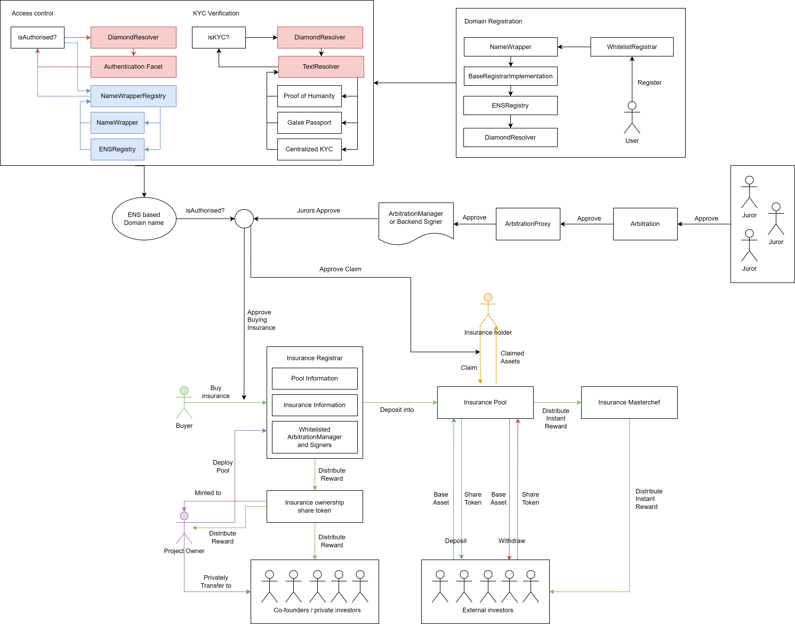

# Very Insure Contract

## Components
1. **very-insure** - Core insurance smart contracts for very insure. Featuring insurance buying, claiming, investing and arbitration.
2. **ens** - An ENS fork with a modification to allow deterministic deployments across chain. Used to register domain names. Name Wrapper is implemented with ERC-721 compatible. Whitelist Registrar is implemented to allow centralized domain registration.
3. **diamond-resolver** - A central system to connect ENS domain name with very insure insurance system. It utilize Diamond and Ethereum Attestation Service to create an ENS resolver system which data is not reset when there is an upgrade. In the other hand, important data is reset when domain owner has changed. More details below.

## Diamond Resolver Use Cases

### Social Profile

Our domain name connects to social profiles such as Twitter, Discord, Facebook, Instagram, Threads, Github and etc which is then used to made decision on insurance registration and claiming by determining the reputation of the applicant. Similar to credit card application process.

### Wallet Connection

Our domain name contains information about wallet address from different kind of chains such as Sui and Aptos. In case we need to expand or claim in these chain, we can do it easily.

### KYC

Diamond resolver is developed to safely store the data even through the resolver get updated. Most importantly, KYC entries are reset when the domain is transfer to someone else for security reason. This property of diamond resolver is perfect for storing KYC data.

Unlike traditional ENS resolver where data are resetted every time the resolver upgrade. But doesn't reset when the domain is transferred to someone else.

### Role Management System

With diamond resolver, we can customize the resolver down into the code. So, we can implement complex role management system to handle any range of insurance requirements in the future.

## Very Insure Components

### InsuranceRegistrar

InsuranceRegistrar is responsible for deploying a new insurance system, buying insurance, managing whitelisted arbitrable proxy and managing fee.

### InsurancePool

InsurancePool is responsible for the investing, claiming and rewarding process.

### InsuranceMasterchef

InsuranceMasterchef is responsible for holding and distributing investors instant reward coming from InsurancePool.

### InsuranceOwnershipToken

A special share token with exactly 10000 total supply responsible for holding and distributing insurance owner reward directly cut from insurance buying in InsuranceRegistrar.

## Diagram

